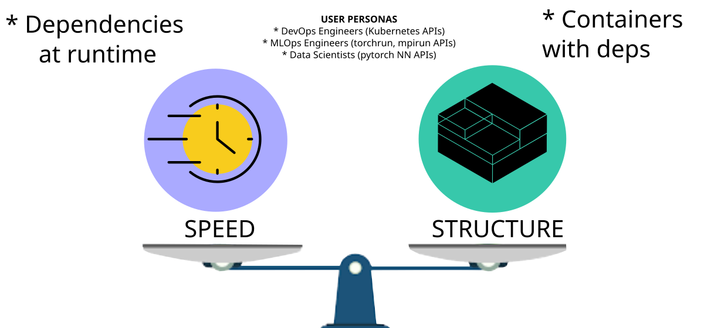
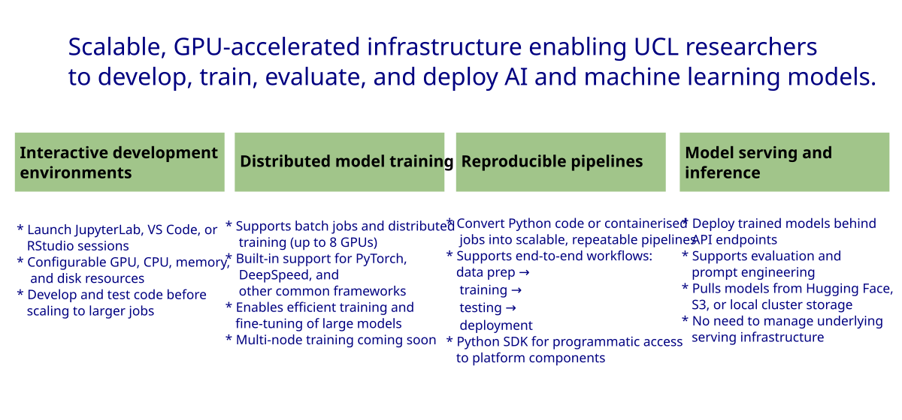
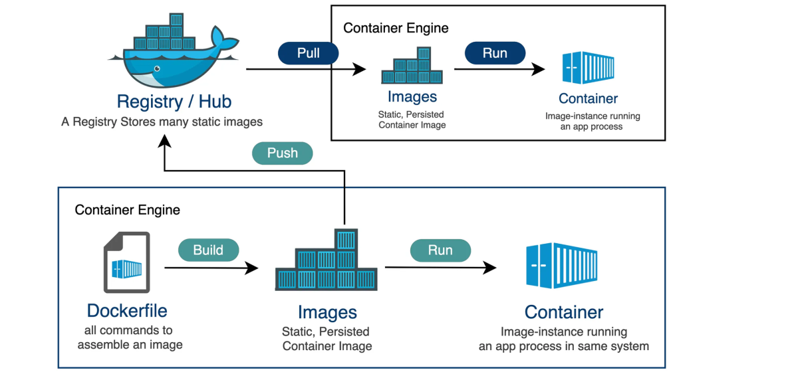
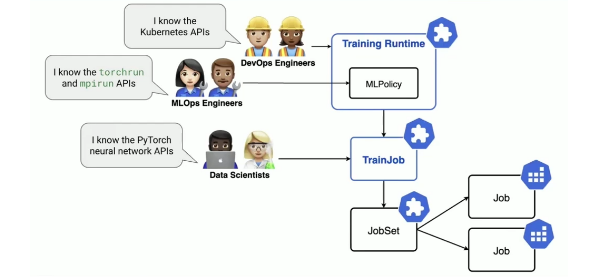

Miguel Xochicale

# 

<div style="background: rgba(10,10,14,0.72);   backdrop-filter: blur(6px);   border: 1px solid rgba(255,255,255,0.08);   border-radius: 18px;   text-align:center;   padding: 1.1em 1.8em;   max-width: max-content;   margin-left: auto;   margin-right: auto;   line-height: 1.5em!important;   box-shadow: 0 20px 60px rgba(0,0,0,0.45);">

<span style="color:#f5f5f7; font-size:1.75em; text-align:center; display:block;">

<!-- TODO: replace with the real talk title -->

<span style="color:#ffffff; font-size:1.65em; display:block; font-weight:800;">Speed
vs Structure: Building Reproducible AI Workflows with the UCL Unified AI
Research Platform</span>

</span>

<span style="font-size:0.55em; color:#b7bdc9;">[Matthias J.
Golomb](https://profiles.ucl.ac.uk/107875-matthias-golomb), [David
Guzman](https://www.linkedin.com/in/david-guzman-555a321ab), [Andrew
Esterson](https://profiles.ucl.ac.uk/99482-andrew-esterson), [Sylvie Da
Graca Ramos](https://profiles.ucl.ac.uk/95114-sylvie-da-graca-ramos),
and [**Miguel Xochicale**](http://mxochicale.github.io/) ·
[UCL-ARC](https://www.ucl.ac.uk/advanced-research-computing/)</span>

<div class="badge-row">

<a href="https://github.com/xfetus/fetal-ultrasound-edm2"
class="badge">⭐ GitHub repo</a>
<a href="https://virtual.oxfordabstracts.com/event/76908/submission/213"
class="badge">📄 Submission abstract 213</a>
<a href="#TO_ADD_ZENODO_DOI" class="badge">🔗 DOI: 10.xxxx/xxxxx</a>

</div>

</div>

<div class="footer">

<span class="dim-text" style="text-align:left;">RSECon26, 9–11 September
2026, Sheffield, UK · [web-animations 2025 by
mxochicale](https://mxochicale.github.io/web-animations/)</span>

</div>

<div class="notes">

<!-- TODO: add opening speaker notes -->

</div>

<!-- ============================================================
     OVERVIEW
     ============================================================ -->

## Overview

<!-- TODO: link items 3-4 to real slide anchors once those sections exist,
     e.g. add `{#sectag_demos}` / `{#sectag_future}` to their section headers -->

1.  [**Introduction**](#sectag_title_1) <add details>
2.  [**Building docker images**](#sectag_title_2) <add details>
3.  [**Training models**](#sectag_title_3) <add details>
4.  [**Rapid vs Structured Workflows**](#sectag_title_4) <add details>
5.  [**Conclusions, Next Steps & Call for Action**](#sectag_title_5)
    <add details>

<div class="notes">

Key Themes

<!-- TODO: replace placeholder keywords -->

> [!NOTE]
>
> ### :cloud: Cloud keywords
>
> keyword1, keyword2, keyword3

> [!TIP]
>
> ### :robot: Robotics keywords
>
> keyword1, keyword2, keyword3

> [!IMPORTANT]
>
> ### :busts_in_silhouette: Collaborative keywords
>
> keyword1, keyword2, keyword3

</div>

<!-- ============================================================
     SECTION: Section title 1
     ============================================================ -->

# Introduction

**Containerising AI workflows**

<div class="notes">

<!-- TODO: notes specific to Section title 1 -->

Walk through the three layers: cloud VMs managed via Terraform/k8s, the
campus network, and physical hardware (sensors, robots).

</div>

<!-- *********************** NEW SLIDE *********************** -->

## Building Reproducible AI Workflows

<div id="fig-template-section1">



Figure 1: Reproducibility is a tradeoff between iteration speed and
environment guarantees

</div>

<div style="font-size: 55%;">

</div>

<div class="notes">

</div>

<!-- *********************** NEW SLIDE *********************** -->

## UCL Unified AI Platform for Research

<div id="fig-template-section1">



Figure 2: Unified AI Platform

</div>

<div style="font-size: 55%;">

Unified AI Platform for Research:
<https://www.ucl.ac.uk/advanced-research-computing/platforms-services/unified-ai-platform-research/>

</div>

<div class="notes">

</div>

<!-- ============================================================
     SECTION: Section title 2
     ============================================================ -->

# Building containers

**Using docker containers**

<div class="notes">

<!-- TODO: notes specific to Section title 2 (was previously a duplicate
     of Section title 1's notes — make sure this describes section 2) -->

</div>

<!-- *********************** NEW SLIDE *********************** -->

## UAI: GitHub Container Registry Workflow

<div id="fig-template-section1">



Figure 3: Worflow for GitHub Container Registry

</div>

<div style="font-size: 55%;">

</div>

<div class="notes">

</div>

<!-- *********************** NEW SLIDE *********************** -->

## Dockerfiles

<div class="panel-tabset">

### SPEED: Dockerfile-scratch-volume

<div class="code-with-filename">

**Dockerfile-scratch-volume**

``` python

# syntax=docker/dockerfile:1.7
FROM docker.io/pytorch/pytorch:2.9.1-cuda12.8-cudnn9-devel

RUN mkdir -p /workspace && chmod -R 777 /workspace
RUN mkdir -p /.cache/pip /.local && chmod -R 777 /.cache/pip /.local

WORKDIR /workspace
```

</div>

### STRUCTURE: Dockerfile -\>

<div class="code-with-filename">

**Dockerfile**

``` python

# syntax=docker/dockerfile:1.7
FROM docker.io/pytorch/pytorch:2.9.1-cuda12.8-cudnn9-devel

RUN mkdir -p /workspace && chmod -R 777 /workspace
WORKDIR /workspace

COPY requirements.txt .

RUN /opt/conda/bin/python -m pip install --upgrade pip && \
    /opt/conda/bin/python -m pip install --no-cache-dir -r requirements.txt

COPY . .

CMD ["/opt/conda/bin/python"]
```

</div>

### \<- requirements.txt

<div class="code-with-filename">

**requirements.txt**

``` python

# core dependencies
pillow
loguru
notebook
numpy
omegaconf
pandas
pyyaml
wandb

# test dependencies
black
codespell
detect-secrets
isort
pre-commit
pylint
pytest

# learning dependencies
accelerate
basicsr
diffusers
einops
scikit-learn
torch
torchvision
```

</div>

</div>

<div class="notes">

Speaker notes go here. {.scrollable}

</div>

<!-- *********************** NEW SLIDE *********************** -->

## Build docker images

<div class="columns">

<div class="column" width="48%">

 **Original Elapse
time** `17:54`

</div>

<div class="column" width="48%">

 **Original elapse
time** `09:41`

</div>

</div>

<div class="notes">

Notes go here

**~46% faster build time**

</div>

<!-- *********************** NEW SLIDE *********************** -->

## Push images to GHCR

<div class="columns">

<div class="column" width="48%">

 **Original elapse
time** `00:24`

</div>

<div class="column" width="48%">

 **Original elapse
time** `23:06`

</div>

</div>

<div class="notes">

Notes go here

</div>

<!-- *********************** NEW SLIDE *********************** -->

## Summary of docker images and GHCR versions

| Version | Local tag | GHCR tag | Image ID | Disk usage | Content size |
|:---|:---|:---|:---|---:|---:|
| v0.0.11 | `fetal-ultrasound-edm2-distributed-learning` | `ghcr.io/xfetus/fetal-ultrasound-edm2/...` | `abafe76a2090` | 27 GB | 9.56 GB |
| v0.1.41 | `fetal-ultrasound-edm2-distributed-learning` | `ghcr.io/xfetus/fetal-ultrasound-edm2/...` | `2e2c049aa527` | 33.8 GB | 12.6 GB |

> [!NOTE]
>
> Local and GHCR tags share the same image ID per version; same content,
> just retagged for the registry.

[View all versions on GHCR
-\>](https://github.com/xfetus/fetal-ultrasound-edm2/pkgs/container/fetal-ultrasound-edm2%2Ffetal-ultrasound-edm2-distributed-learning/versions)

<div class="notes">

Notes go here

Improve push mechanics

Enable BuildKit (DOCKER_BUILDKIT=1); better caching and often better
layer diffing. Check your upload bandwidth (speedtest-cli or similar);
genuinely limited pipes will bottleneck no matter what you do to the
image. Consider pushing from a CI runner (e.g., GitHub Actions) with a
much better uplink than your local machine, especially since you’re
already targeting GHCR — building and pushing to GHCR from a GitHub
Actions workflow avoids your local upload bottleneck entirely.

</div>

<!-- ============================================================
     SECTION: Section title 3
     ============================================================ -->

# Training models

**Using Unified AI Kubeflow Trainer**

<div class="notes">

<!-- TODO: notes specific to Section title 2 (was previously a duplicate
     of Section title 1's notes — make sure this describes section 2) -->

</div>

<!-- *********************** NEW SLIDE *********************** -->

## UAI Kubeflow Trainer: User personas and capabilities

<div id="fig-template-section1">



Figure 4: User Personas in Kubeflow Trainer

</div>

<div style="font-size: 55%;">

An overview of Kubeflow Trainer:
<https://www.kubeflow.org/docs/components/trainer/overview/>

</div>

<div class="notes">

</div>

<!-- *********************** NEW SLIDE *********************** -->

## Training EDM2 Model (kubeflow 0.4.0)

<div class="panel-tabset">

### SPEED: training-edm2-model-scratch-volume

<div class="code-with-filename">

<div class="code-with-filename-file">

<pre><a href="https://github.com/xfetus/fetal-ultrasound-edm2/blob/main/unified-ai/training-edm2-model-scratch-volume.ipynb" target="_blank"><strong>training-edm2-model-scratch-volume.ipynb</strong></a></pre>

</div>

</div>

``` python

## Set how many PyTorch nodes you want to use for distributed training.
NUM_NODES = 1

# Set the resources for each PyTorch node.
RESOURCES_PER_NODE = {
    "cpu": "4",           # CPUs per node
    "memory": "64Gi",     # Memory in GiB per node (tried 2Gi CrashLoopBackOff/OOMKilled), 64Gi works
    "nvidia.com/gpu": 1,  # GPUs per node (the number will depend on the available resources)
}

GITHUB_CONTAINER_REGISTRY = "ghcr.io/xfetus/fetal-ultrasound-edm2/fetal-ultrasound-edm2-distributed-learning:v0.0.1"
# VERSION_ID=v0.0.1 #FROM docker.io/pytorch/pytorch:2.9.1-cuda12.8-cudnn9-devel / RUN mkdir -p /workspace && chmod -R 777 /workspace 
#                    RUN mkdir -p /.cache/pip /.local && chmod -R 777 /.cache/pip /.local


## Volume mounts
from kubeflow.trainer.options.kubernetes import RuntimePatch

pod_name = "node"
volume_name = "scratch-volume"
mount_path = "/scratch-volume"
volumes = [{"name": volume_name, "persistentVolumeClaim": {"claimName": volume_name}}]
volume_mounts = [{"name": volume_name, "mountPath": mount_path}]

volume_patch = RuntimePatch(
    training_runtime_spec={
        "template": {
            "spec": {
                "replicatedJobs": [
                    {
                        "name": "node",
                        "template": {
                            "spec": {
                                "template": {
                                    "spec": {
                                        "volumes": volumes,
                                        "containers": [
                                            {
                                                "name": pod_name,
                                                "volumeMounts": volume_mounts,
                                            }
                                        ],
                                    }   
                                }    
                            }
                        },
                    }
                ]
            }
        }
    }
)


## Trainer Command 

command = TrainerCommand(
    command=[
        "bash", "-c",
        (
            # Create writable dirs
            "mkdir -p /scratch-volume/pip-packages "
            "/scratch-volume/torch-inductor-cache "
            "/scratch-volume/home && "
            # Install deps exclude torch/torchvision (already in base image)
            # Use --upgrade to overwrite stale packages from previous runs
            "pip install "
            "pandas "
            "accelerate "
            "basicsr "
            "diffusers "
            "einops "
            "scikit-learn "
            "--target=/scratch-volume/pip-packages "
            "--upgrade "
            "--no-cache-dir "
            "--quiet && "
            # Set cache env vars inline to guarantee they're set before torchrun
            "export HOME=/scratch-volume/home && "
            "export TORCHINDUCTOR_CACHE_DIR=/scratch-volume/torch-inductor-cache && "
            "export PYTHONPATH=/scratch-volume/pip-packages:$PYTHONPATH && "          
            "torchrun /scratch-volume/fetal-ultrasound-edm2/train_edm2.py "
            "--outdir /scratch-volume/data-fetal-us-edm2/OUTPUT_DIRECTORY "
            "--data /scratch-volume/data-fetal-us-edm2/FETAL_PLANES_DB "
            "--fpus23 /scratch-volume/data-fetal-us-edm2/FPUS23 "
            "--african /scratch-volume/data-fetal-us-edm2/AfricanDataset/Zenodo_dataset "
            "--fetal-abdomen /scratch-volume/data-fetal-us-edm2/FetalAbdominalSegmentation/IMAGES "
            "--batch 4 "
            "--preset edm2-img512-s "
            "--batch-gpu 4"
        )
    ]
)


job_id = trainer.train(
    runtime=trainer.get_runtime("torch-distributed"),
    trainer=CustomTrainerContainer(
        image=GITHUB_CONTAINER_REGISTRY,
        num_nodes=NUM_NODES,
        resources_per_node=RESOURCES_PER_NODE,
        env=ENV_VARS        
    ),
    options=[volume_patch, command],
)

```

### STRUCTURE: training-edm2-model-ghcr

<div class="code-with-filename">

<div class="code-with-filename-file">

<pre><a href="https://github.com/xfetus/fetal-ultrasound-edm2/blob/main/unified-ai/training-edm2-model-ghcr.ipynb" target="_blank"><strong>training-edm2-model-ghcr.ipynb</strong></a></pre>

</div>

</div>

``` python


## Set how many PyTorch nodes you want to use for distributed training.
NUM_NODES = 1

# Set the resources for each PyTorch node.
RESOURCES_PER_NODE = {
    "cpu": "4",           # CPUs per node
    "memory": "64Gi",     # Memory in GiB per node (tried 2Gi CrashLoopBackOff/OOMKilled), 64Gi works
    "nvidia.com/gpu": 1,  # GPUs per node (the number will depend on the available resources)
}

GITHUB_CONTAINER_REGISTRY = "ghcr.io/xfetus/fetal-ultrasound-edm2/fetal-ultrasound-edm2-distributed-learning:v0.1.1"


## Mount scratch volume

from kubeflow.trainer.options.kubernetes import RuntimePatch

pod_name = "node"
volume_name = "scratch-volume"
mount_path = "/scratch-volume"
volumes = [{"name": volume_name, "persistentVolumeClaim": {"claimName": volume_name}}]
volume_mounts = [{"name": volume_name, "mountPath": mount_path}]

volume_patch = RuntimePatch(
    training_runtime_spec={
        "template": {
            "spec": {
                "replicatedJobs": [
                    {
                        "name": "node",
                        "template": {
                            "spec": {
                                "template": {
                                    "spec": {
                                        "volumes": volumes,
                                        "containers": [
                                            {
                                                "name": pod_name,
                                                "volumeMounts": volume_mounts,
                                            }
                                        ],
                                    }   
                                }    
                            }
                        },
                    }
                ]
            }
        }
    }
)


## Trainer command
command = TrainerCommand(
    command=[
        "torchrun",
        f"--nnodes={NUM_NODES}",
        "train_edm2.py", #path of script in scratch 
        "--outdir /scratch-volume/FETAL_PLANES_DB/OUTPUT_DIRECTORY", # pragma: allowlist secret
        "--data /scratch-volume/data-fetal-us-edm2/FETAL_PLANES_DB",
        "--fpus23 /scratch-volume/data-fetal-us-edm2/FPUS23",
        "--african /scratch-volume/data-fetal-us-edm2/AfricanDataset/Zenodo_dataset",
        "--fetal-abdomen /scratch-volume/data-fetal-us-edm2/FetalAbdominalSegmentation/IMAGES",
        "--batch 4",
        "--preset edm2-img512-s",
        "--batch-gpu 4",
    ]
)

## Train trainer
job_id = trainer.train(
    runtime=trainer.get_runtime("torch-distributed"),
    trainer=CustomTrainerContainer(
        image=GITHUB_CONTAINER_REGISTRY,
        num_nodes=NUM_NODES,
        resources_per_node=RESOURCES_PER_NODE,
        env=ENV_VARS        
    ),
    options=[volume_patch, command],
)


```

</div>

<div style="font-size: 55%;">

Jupyter Notebooks:\
<https://github.com/xfetus/fetal-ultrasound-edm2/blob/main/unified-ai/training-edm2-model-ghcr.ipynb>\
<https://github.com/xfetus/fetal-ultrasound-edm2/blob/main/unified-ai/training-edm2-model-scratch-volume.ipynb>

</div>

<div class="notes">

Speaker notes go here. {.scrollable}

</div>

<!-- ============================================================
     SECTION: Section title 4
     ============================================================ -->

# Reproducing results

Rapid vs Structured Workflows

<div class="notes">

<!-- TODO: notes specific to Section title 2 (was previously a duplicate
     of Section title 1's notes — make sure this describes section 2) -->

</div>

<!-- *********************** NEW SLIDE *********************** -->

## Diffusion-based synthesis (512×512)

<div id="fig-template-section2">


Figure 5: Representative fetal ultrasound images from real data, Tian et
al. \[22\], and our proposed high-resolution (512×512) diffusion-based
synthesis approach.

</div>

<div style="font-size: 55%;">

**Mannering et al. 2026** in Medical Image Understanding and Analysis
(MIUA) 2026 <https://arxiv.org/abs/2608.05471>

</div>

<div class="notes">

Speaker notes go here.

</div>

<!-- *********************** NEW SLIDE *********************** -->

## Reproduce this work

<div class="columns">

<div class="column" width="55%">

#### Get running in three steps

1.  **Clone** the repo, everything here (code, data, this deck) lives in
    one place
2.  **Build** the environment `Dockerfile` included
3.  **Run** the notebook or pipeline, outputs regenerate the figures in
    this talk

``` bash
git clone https://github.com/xfetus/fetal-ultrasound-edm2.git
```

</div>

<div class="column" width="45%">

<div class="card">

<span class="card-icon">📦</span> What’s included:\
- Source code + tests\
- Reproducible environment\
- Example data / demo notebook\
- This slide deck (Quarto)

</div>

<a href="https://github.com/xfetus/fetal-ultrasound-edm2"
class="cta">View on GitHub →</a>

</div>

</div>

<div class="notes">

Emphasise licensing and how to cite — point people to the CITATION.cff
if the repo has one.

</div>

<!-- ============================================================
     SECTION: Section title 4
     ============================================================ -->

# Conclusions, Next Steps & Call for action

<div class="notes">

<!-- TODO: notes specific to Section title 2 (was previously a duplicate
     of Section title 1's notes — make sure this describes section 2) -->

</div>

<!-- *********************** NEW SLIDE *********************** -->

## Conclusions

- **Started UCL’s adoption of Unified AI**\
  *Cuts vendor reliance and lowers infrastructure cost*

- **Speed and rigour are not a trade-off**\
  *Fast experimentation and reproducible engineering coexist*

- **512×512 image diffusion synthesis**\
  *Proves the platform supports publishable research (MIUA 2026)*

<div class="notes">

Notes go here

TALK ABOUT DATA, speed of docker builts here \* **Scratch-volume
prototyping vs. GHCR containerised production**: *same execution path,
different trade-offs of speed vs. scalability*

<div style="font-size: 55%;">

**Sciortino et al. 2017** in Computers in Biology and Medicine
<https://doi.org/10.1016/j.compbiomed.2017.01.008> **He et al. 2021** in
Front. Med. <https://doi.org/10.3389/fmed.2021.729978>

</div>

</div>

<!-- *********************** NEW SLIDE *********************** -->

## Next Steps

- **Standardise practice**\
  *drive consistent, reproducible research workflows across teams*
- **Document good infrastructure practice**\
  *share patterns that support DevOps/MLOps engineers, data scientists,
  and RSEs*
- **Grow the community**\
  *use hackathons, workshops, and training sessions to spread adoption
  and gather feedback*
- **Scale beyond one use case**\
  *validate the SPEED/STRUCTURE pattern on additional model types and
  datasets*

<div class="notes">

Notes go here

<div style="font-size: 55%;">

**Sciortino et al. 2017** in Computers in Biology and Medicine
<https://doi.org/10.1016/j.compbiomed.2017.01.008> **He et al. 2021** in
Front. Med. <https://doi.org/10.3389/fmed.2021.729978>

</div>

</div>

<!-- *********************** NEW SLIDE *********************** -->

## Call for action

We want to hear from you.

- 🤝 **Get in touch**:\
  *share your experience of good practice and how we can make better use
  of this platform together*

- 🔁 **Cross-faculty collaboration**:\
  *contribute shared case studies from your own research area*

- 🏛️ **Partnerships via honorary contracts**:\
  *the route to getting access to UCL infrastructure*

<div class="notes">

Notes go here

<div style="font-size: 55%;">

**Sciortino et al. 2017** in Computers in Biology and Medicine
<https://doi.org/10.1016/j.compbiomed.2017.01.008> **He et al. 2021** in
Front. Med. <https://doi.org/10.3389/fmed.2021.729978>

</div>

</div>

<!-- ============================================================ -->

## Thank You

<div class="columns">

<div class="column" width="35%">

### Collaborators

- Harvey Mannering (PhD student) and Zhiwu Huang (Lecturer) at
  University of Southampton
- Yilin Zhang (PhD student) at University of Southampton\
- Ziao Liu (PhD student) at Tsinghua University\
- Jacqueline Matthew ( Clinical Research Fellow) at King’s College
  London

</div>

<div class="column" width="55%">

### Unified AI Team

<div class="card">

<span class="card-icon"> </span>

Dorothy Chung, Matthias Golomb, David Guzman, Andrew Esterson and Sylvie
Ramos

</div>

------------------------------------------------------------------------

> [!NOTE]
>
> ### :speech_balloon: Get in Touch
>
> **Email**: [m.xochicale@ucl.ac.uk](m.xochicale@ucl.ac.uk)\
> **GitHub**: [github.com/mxochicale](https://github.com/mxochicale)\
> **LinkedIn**: [in/mxochicale](https://linkedin.com/in/mxochicale)\
> **UCL ARC**: [ucl.ac.uk/arc](https://www.ucl.ac.uk/arc)\
> **Unified AI**: [Unified AI Platform for
> Research](https://www.ucl.ac.uk/advanced-research-computing/platforms-services/unified-ai-platform-research/)

</div>

</div>

<div class="notes">

Thank the room. Leave the slide up during questions. GitHub handle and
repo URL are visible for anyone who wants to follow up.

{.smaller}

</div>
