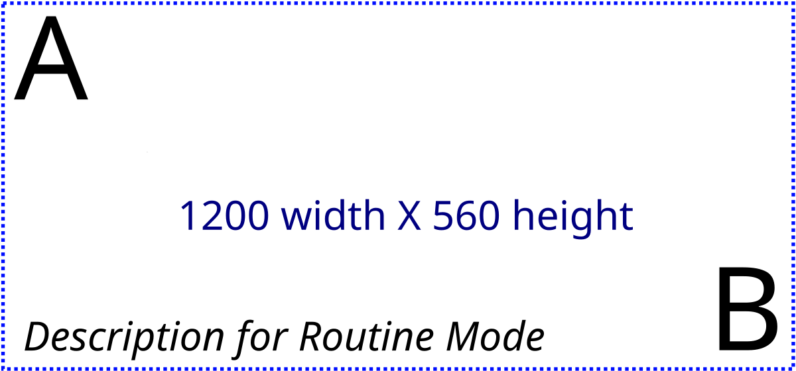

# {.title-slide .centeredslide background-iframe="https://mxochicale.github.io/web-animations/" loading="lazy"}

::: {style="background: rgba(10,10,14,0.72);
  backdrop-filter: blur(6px);
  border: 1px solid rgba(255,255,255,0.08);
  border-radius: 18px;
  text-align:center;
  padding: 1.1em 1.8em;
  max-width: max-content;
  margin-left: auto;
  margin-right: auto;
  line-height: 1.5em!important;
  box-shadow: 0 20px 60px rgba(0,0,0,0.45);"}

<span class="kicker">Open · Reproducible · Ready to fork</span>

<span style="color:#f5f5f7; font-size:1.75em; text-align:center; display:block;">

<!-- TODO: replace with the real talk title -->
[Add Title]{style="color:#ffffff; font-size:1.65em; display:block; font-weight:800;"}

</span>

[ [**Name Lastname**](http://name-surname.github.io/) · [Organisation](https://www.ucl.ac.uk/advanced-research-computing/)]{style="font-size:0.55em; color:#b7bdc9;"}

::: {.badge-row}
[⭐ GitHub repo](#){.badge}
[📄 License: Apache 2.0](#){.badge}
[🔗 DOI: 10.xxxx/xxxxx](#){.badge}
:::

:::

::: footer
[Add Event name?, date? and place? · [web-animations 2025 by mxochicale](https://mxochicale.github.io/web-animations/)]{.dim-text style="text-align:left;"}
:::

::: {.notes}
<!-- TODO: add opening speaker notes -->
:::


<!-- ============================================================
     OVERVIEW
     ============================================================ -->
## Overview {.smaller background-color="#0d1b2a"}


:::: {.columns}

::: {.column width="50%"}
### What We'll Cover

<!-- TODO: link items 3-4 to real slide anchors once those sections exist,
     e.g. add `{#sectag_demos}` / `{#sectag_future}` to their section headers -->
1. [**Section title 1**](#sectag_title_1) - <add details>
2. [**Section title 2**](#sectag_title_2) - <add details>
3. **Demonstrations** - <add details>
4. **Future Work** - <add details>
:::

::: {.column width="50%"}
### Key Themes

<!-- TODO: replace placeholder keywords -->
::: {.callout-note icon=false}
## :cloud: Cloud keywords
keyword1, keyword2, keyword3
:::

::: {.callout-tip icon=false}
## :robot: Robotics keywords
keyword1, keyword2, keyword3
:::

::: {.callout-important icon=false}
## :busts_in_silhouette: Collaborative keywords
keyword1, keyword2, keyword3
:::
:::

::::


<!-- ============================================================
     SECTION: Section title 1
     ============================================================ -->
# Section title 1 {#sectag_title_1 .section-divider}
**Add Subtitle**

::: {.notes}
<!-- TODO: notes specific to Section title 1 -->
Walk through the three layers: cloud VMs managed via Terraform/k8s,
the campus network, and physical hardware (sensors, robots).
:::


<!-- *********************** NEW SLIDE *********************** -->
##  Github: Getting started docs {style="font-size: 100%;"}

::: {#fig-template-section2}

{fig-align=center}

Getting started documentation provide with a range of links to setup, use, run and debug application including github workflow.
:::

::: {style="font-size: 55%;"}
**Sciortino et al. 2017** in Computers in Biology and Medicine <https://doi.org/10.1016/j.compbiomed.2017.01.008>
**He et al. 2021** in Front. Med. <https://doi.org/10.3389/fmed.2021.729978>
:::

::: {.notes}
Speaker notes go here.
:::


<!-- ============================================================
     SECTION: Section title 2
     ============================================================ -->
# Section title 2 {#sectag_title_2 .section-divider}

**Add Subtitle**

::: {.notes}
<!-- TODO: notes specific to Section title 2 (was previously a duplicate
     of Section title 1's notes — make sure this describes section 2) -->
:::


<!-- *********************** NEW SLIDE *********************** -->
##  Github: Getting started docs {style="font-size: 100%;"}

::: {#fig-template-section2}

{fig-align=center}

Getting started documentation provide with a range of links to setup, use, run and debug application including github workflow.
:::

::: {style="font-size: 55%;"}
**Sciortino et al. 2017** in Computers in Biology and Medicine <https://doi.org/10.1016/j.compbiomed.2017.01.008>
**He et al. 2021** in Front. Med. <https://doi.org/10.3389/fmed.2021.729978>
:::

::: {.notes}
Speaker notes go here.
:::


<!-- *********************** NEW SLIDE *********************** -->
## Title of the slide {style="font-size: 100%;"}

* Bullet point 1
* Bullet point 2
* **Bullet point** 3
  * Bullet point 3.1
  * Bullet point 3.2


::: {style="font-size: 55%;"}
**Sciortino et al. 2017** in Computers in Biology and Medicine <https://doi.org/10.1016/j.compbiomed.2017.01.008>
**He et al. 2021** in Front. Med. <https://doi.org/10.3389/fmed.2021.729978>
:::

::: {.notes}
Notes go here
:::


<!-- ============================================================
     EXTRA SLIDES (appendix)
     ============================================================ -->
# Appendix {background-color="#111111"}

Extra slides for Q&A


<!-- *********************** NEW SLIDE *********************** -->
## Title of the slide {style="font-size: 100%;"}

* Bullet point 1
* Bullet point 2
* **Bullet point** 3
  * Bullet point 3.1
  * Bullet point 3.2


::: {style="font-size: 55%;"}
**Sciortino et al. 2017** in Computers in Biology and Medicine <https://doi.org/10.1016/j.compbiomed.2017.01.008>
**He et al. 2021** in Front. Med. <https://doi.org/10.3389/fmed.2021.729978>
:::

::: {.notes}
Notes go here
:::


<!-- *********************** NEW SLIDE *********************** -->
##  Github: Getting started docs {style="font-size: 100%;"}

::: {#fig-template-section1}

{fig-align=center}

Getting started documentation provide with a range of links to setup, use, run and debug application including github workflow.
:::

::: {style="font-size: 55%;"}
**Sciortino et al. 2017** in Computers in Biology and Medicine <https://doi.org/10.1016/j.compbiomed.2017.01.008>
**He et al. 2021** in Front. Med. <https://doi.org/10.3389/fmed.2021.729978>
:::

::: {.notes}
Speaker notes go here.
:::


<!-- ============================================================
     CALL TO ACTION: Reproduce this work
     ============================================================ -->
## Reproduce this work


:::: {.columns}

::: {.column width="55%"}
#### Get running in three steps

1. **Clone** the repo — everything here (code, data, this deck) lives in one place
2. **Build** the environment — `Dockerfile` / `environment.yml` included
3. **Run** the notebook or pipeline — outputs regenerate the figures in this talk

```bash
git clone https://github.com/<org>/<repo>.git
cd <repo>
# TODO: add your one-line setup command
```
:::

::: {.column width="45%"}
::: {.card}
<span class="card-icon">📦</span>
#### What's included
- Source code + tests
- Reproducible environment
- Example data / demo notebook
- This slide deck (Quarto)
:::

[View on GitHub →](#){.cta}
:::

::::

::: {.notes}
Emphasise licensing and how to cite — point people to the CITATION.cff if the repo has one.
:::